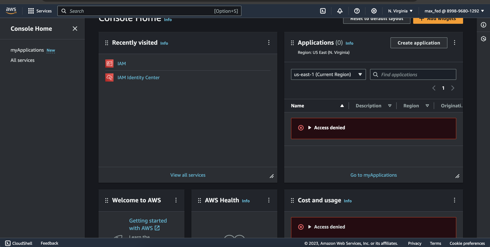
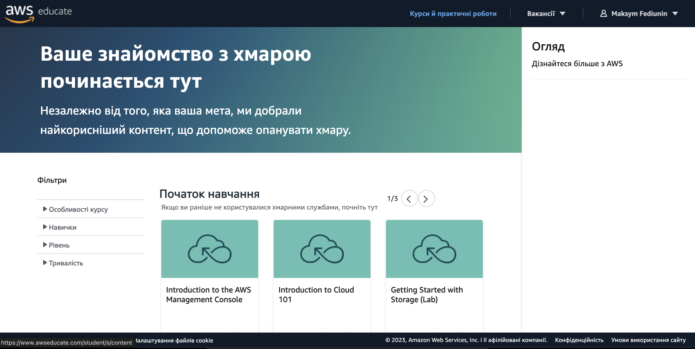
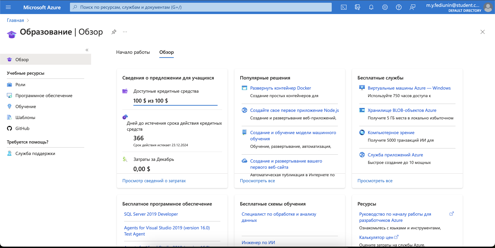

# Лабораторна робота 1
1. Зареєстрував акаунт у AWS

2. Зареєструвався у Amazon Educate.

3. Зареєстрував безкоштовний студентський акаунт у Microsoft Azure

4. Акаунт GitHub в мене вже був зареєстрований, тож я авторизувався та створив репозиторій для цього предмету та папку для першої роботи.