# Лабораторна робота 3

1. Створив лямбда-фунцію
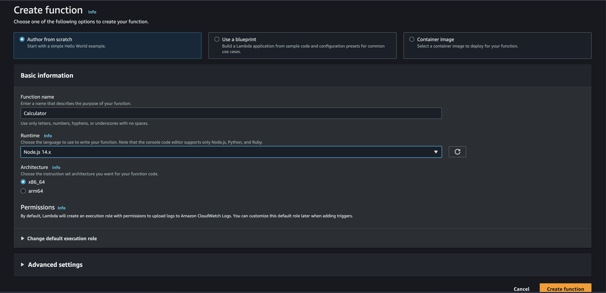
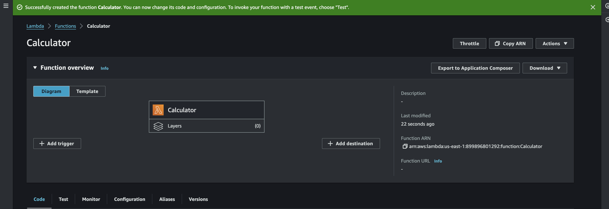
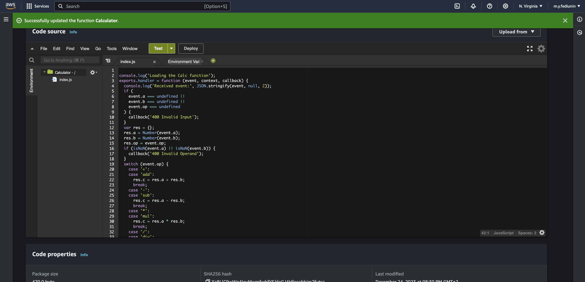

2. Протестував функцію.
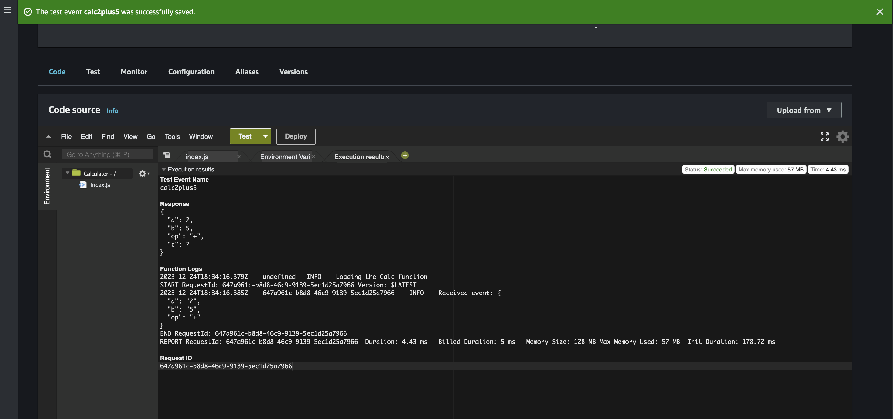

3. Сконфігурував пермішени
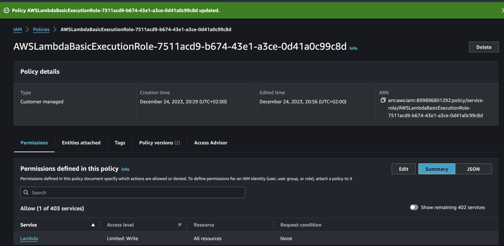
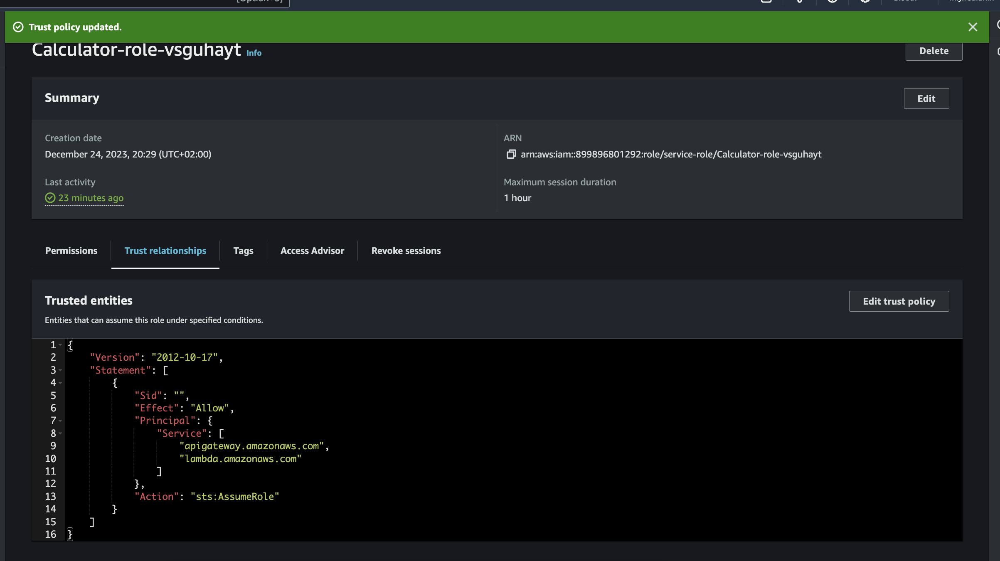

4. Створив тестове АПІ
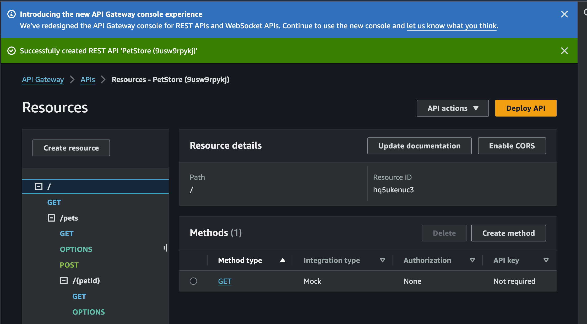

5. Створив АПІ для лабораторної роботи
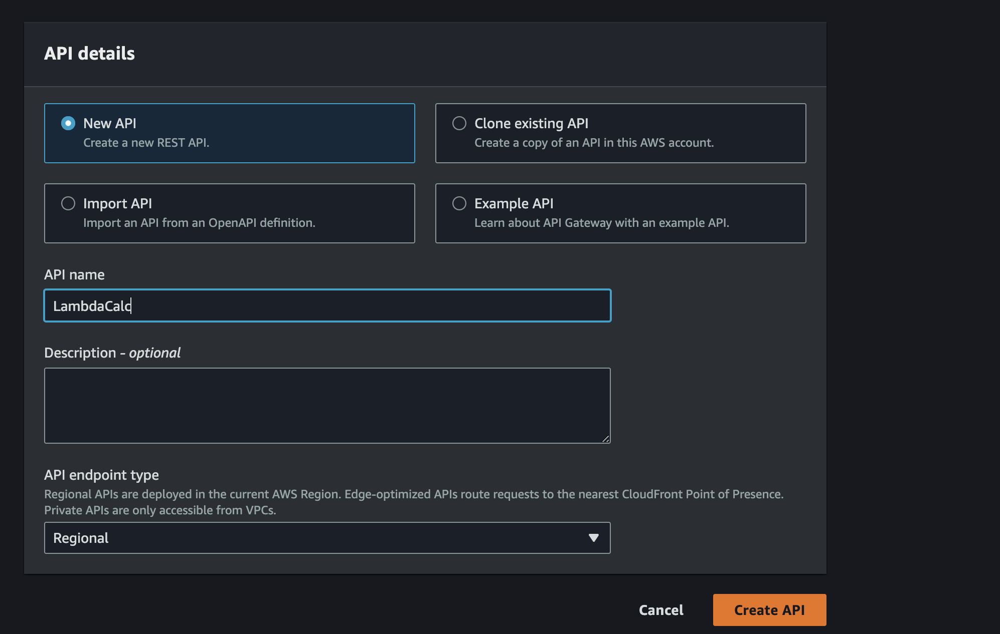

6. Створив ресурс калькулятора
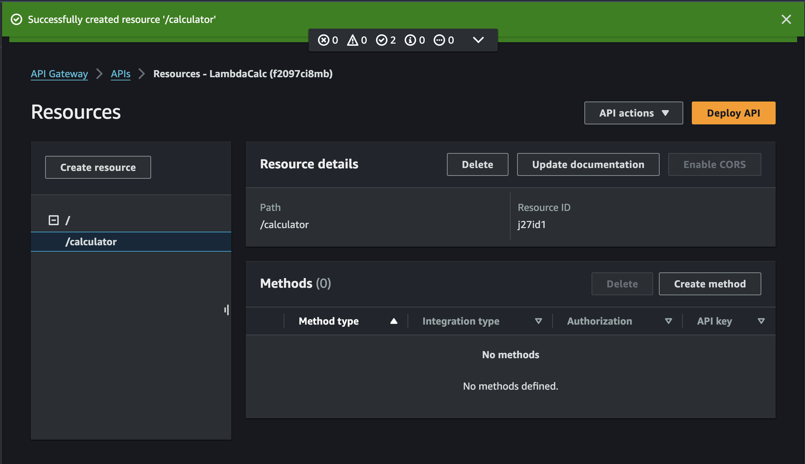

6. Створив GET-метод для ресурса
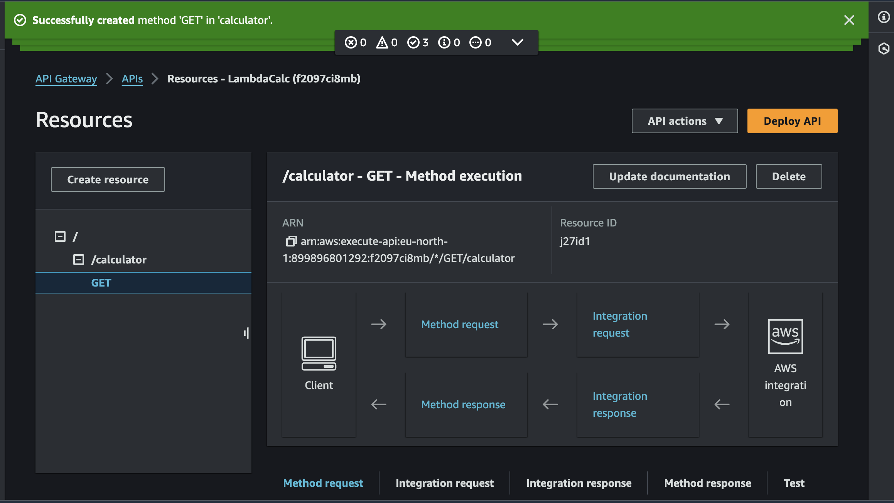

7. Провів налаштування та тестування метода
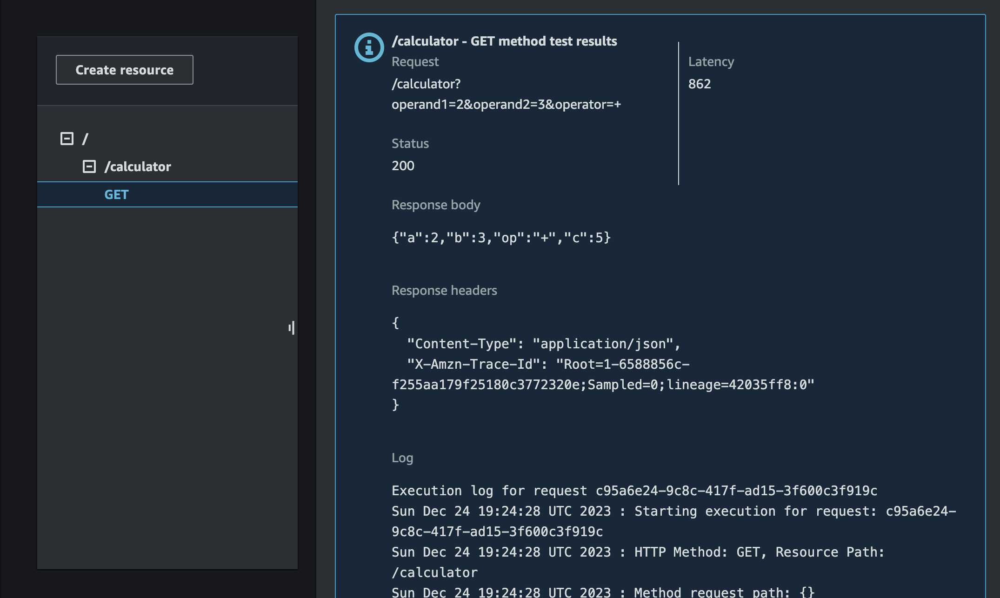

8. Задеплоїв метод АПІ
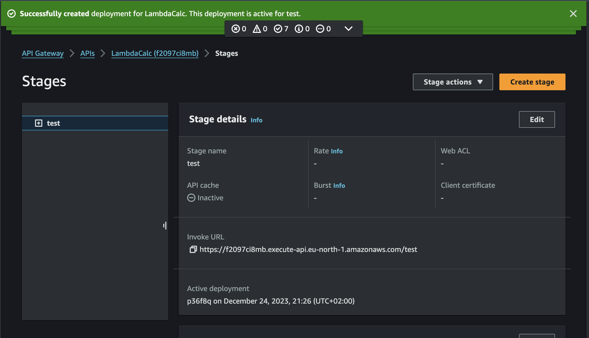

8. Перевірив роботу метода АПІ у браузері
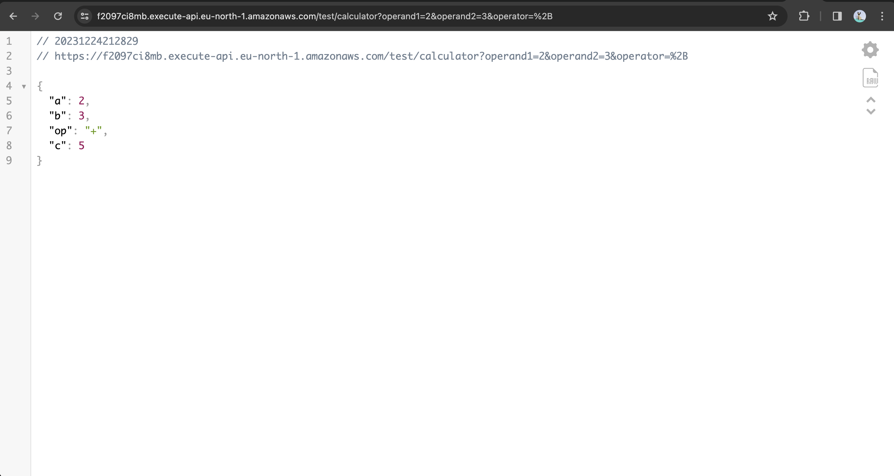

9. Створив моделі для POST-метода АПІ
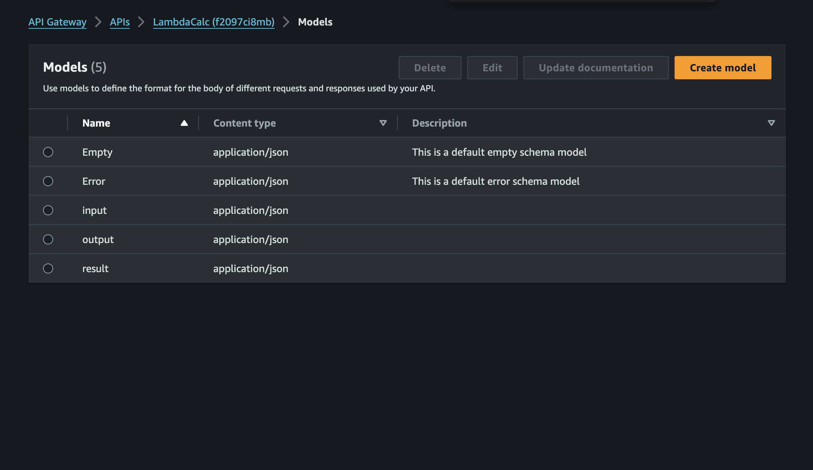

10. Перевірив у Постмані роботу метода після деплою
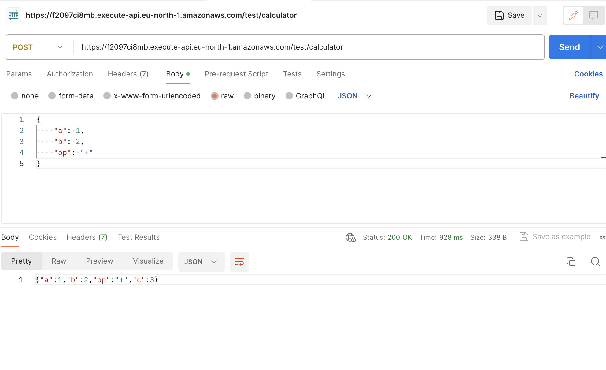

11. Створив метод у якому параметри передаються у параметрах шляху
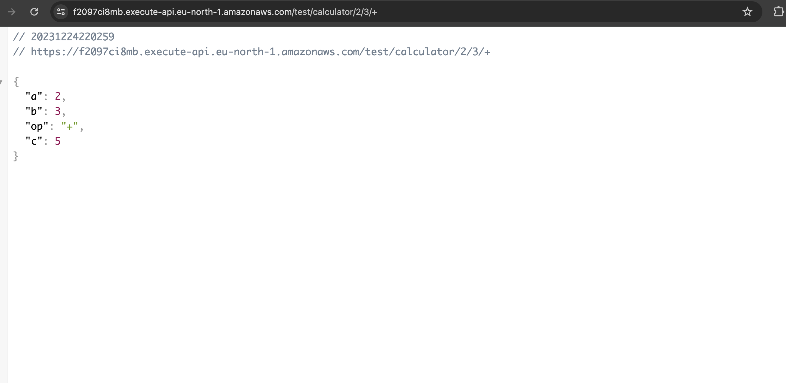

12. Видалив стейдж
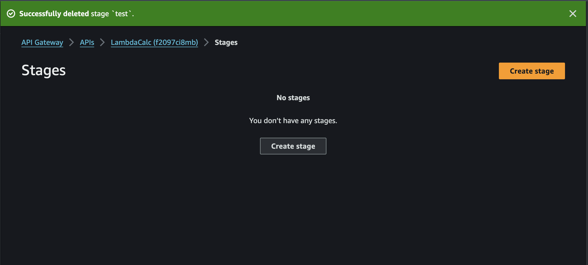